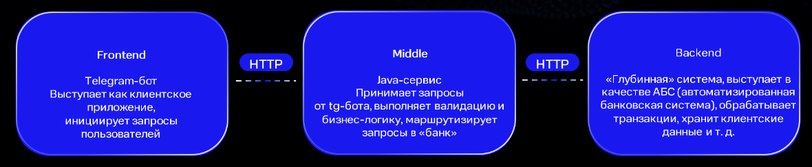
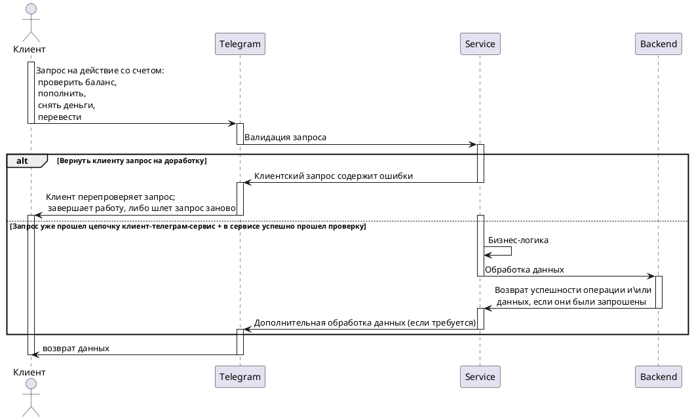

<h1 align="center"> khasmamedov-telegram-bot </h1>

<h1 align="center"> Банковское приложение с телеграмм-ботом и начинкой на java, c внешним хранилищем данных</h1>

### Базовое верхнеуровневое представление:  

  

  <h3> Про проект в-общем: </h3>
  1. Бот является лишь пользовательским интерфейсом, что взаимодействует с пользователем (фронт) </i>
    
  2. Сервис, или прослойка (движок), написанная на java, выполняет бизнес-логику и выступает прокладкой между фронтом и БД
    
  3. Второй слой, или БД (аналог ДАО) - служит для хранения и обработки данных
    
  <b><a href="https://gpb.fut.ru/itfactory/backend?utm_source=gpb&utm_medium=expert&utm_campaign=recommend&utm_content=all">GBP IT-factory</a></b> | <b><a href="">Документация(_пока пуста_)</a></b> | <b><a href="">Демо(_пока пуста_)</a></b> | <b><a href="https://github.com/gpb-it-factory/khasmamedov-telergam-bot">GitHub</a></b> | <b><a href="#Как_запустить_и_начать_работу">Запуск и начало работы</a></b>
    
  
  
    

### Картинка выше в качестве UML-диаграммы:

### Как_запустить_и_начать_работу
((пока пусто))

