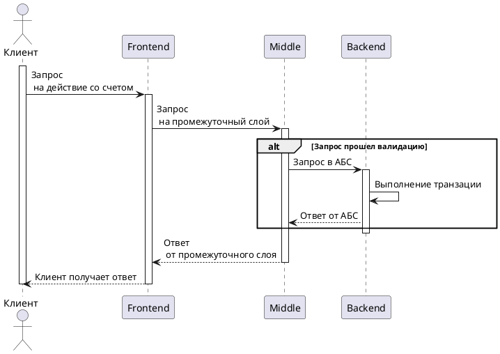

<h1 align="center"> Банковское приложение с телеграмм-ботом и начинкой на java c БД</h1>

<p align="left">
  Приложение на основе трехвенной архитектуры:
  <br/><br/>
  1. Бот является лишь пользовательским интерфейсом, что инициирует запросы пользователя (фронт) </i>
  <br/><br/>
  2. Сервис, или прослойка (движок), написанная на java, выполняет бизнес-логику и выступает прокладкой между фронтом и БД
  <br/><br/>
  3. Второй слой, или БД - служит для хранения и обработки данных
  <br/><br/>
  <b><a href="https://gpb.fut.ru/itfactory/backend?utm_source=gpb&utm_medium=expert&utm_campaign=recommend&utm_content=all">Ссылка на школу</b> | <b><a href="">Ссылка на доку(_пока пуста_)</a></b> | <b><a href="">Ссылка на демо(_пока пуста_)</a></b> | <b><a href="https://github.com/gpb-it-factory/khasmamedov-telergam-bot">GitHub</a></b>
  <br/><br/>
  <a href="https://github.com/gpb-it-factory/khasmamedov-telergam-bot/CHANGELOG.md"></a>
  <a target="_blank" href="https://github.com/gpb-it-factory/khasmamedov-telergam-bot"></a>
  <br/><br/>
  
  
</p>

  

ЗАВТРА!
посмотреть RAW (вероятно и нельзя, так что мб нахуй и не надо?)
посмотреть ссылки ниже - на определенные разделы ридми, дабы кликабельно было
посмотреть как ребята делают плантЮМЛ

### Что здесь будет *сейчас* (05.05.2024):
- описание проекта;
- общая схема;

# ganeev-telegram-bot
# Ganeev-telegram-bot
## Введение
Приложение представляет собой "Мини-банк", состоящий из трех компонентов:
- Frontend(telegram-bot на Java)
- Middle-слой (Java-сервис)
- Backend (Java-сервис)


<p align="center">
Разделы 
</p>

<p align="center">&nbsp;&bull;&nbsp;
<a href="##tools">Tools</a> &nbsp;&bull;&nbsp;
<a href="#description-">Description</a> &nbsp;&bull;&nbsp;
<a href="#how-it-works">How it works</a> &nbsp;&bull;&nbsp;
<a href="#quick-start">Quick start</a> &nbsp;&bull;&nbsp;
</p>

## Tools
- Java
- Gradle
- Spring
- Posgresql


## Description
### Frontend
Принимает запросы пользователей через телеграм и отправляет их в промежуточный слой
### Middle-слой
Представляет собой промежуточный слой, который принимает запросы от telegram-бота, выполняет валидацию и маршрутизирует запросы в "Банк"
### Backend
Система, которая выступает в качестве автоматизированной банковской системы, выполняющей транзакции и хранящей клиентские данные

## How it works



## Quick start
Will be here soon...

# lukina-telegram-bot

Мини-банк

## Архитектура
### Frontend (java/kotlin)
Клиентское приложение. Инициирует запросы пользователей.
### Middle layer (java/kotlin)
* Принимает запросы от tg-бота
* Выполняет валидацию и бизнес-логику
* Маршрутизирует запросы в backend
### Backend (java/kotlin)
Автоматизированная банковская система
* Обрабатывает транзакции
* Хранит клиентские данные

```plantuml
@startuml
participant Frontend
participant Middle
participant Backend
Frontend -> Middle: HTTP-запрос
alt Запрос валиден
    Middle -> Backend: HTTP-запрос
else Запрос невалиден
    Middle -> Frontend: Ошибка
end
Backend -> Middle: Данные
Middle -> Frontend: Обработанные данные
@enduml